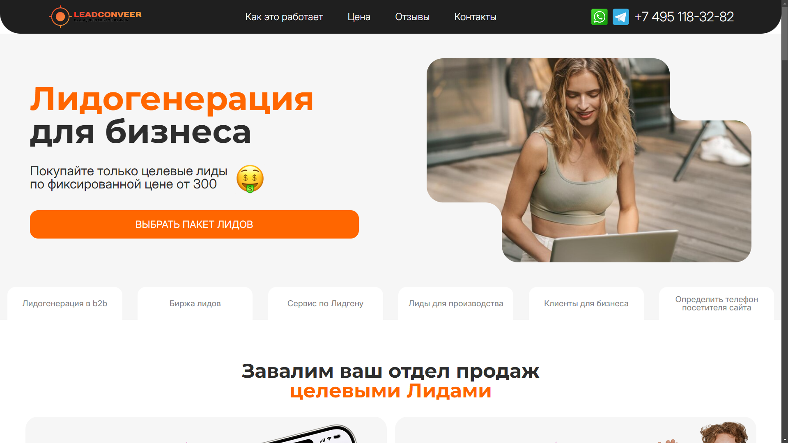

# Lead Site

Этот проект — одностраничный лендинг, который выполнен для тренеровочной работы по макету оригинального редизайна сайта LeadConveer. Код написан на HTML/CSS/JS без фреймворков.

## Фото проекта

## Демонстрация в Pages

Демо сайт можно просмотреть по ссылке: https://aasevastyanov.github.io/Lead-Site/

## Основные файлы и папки

- **index.html**  
  Главный файл страницы (одностраничник).

- **README.md**  
  Файл с описанием проекта.
  
- **assets/**  
  - **css/**  
    - `reset.css` — сбрасывает стандартные стили браузера.  
    - `index.css` — стили сайта: сетки, кнопки, оформление и т.д.
  - **js/**  
    - `slider.js` — логика переключения слайдов (отображения секций).  
    - `questions_more.js` — скрипт, который раскрывает/скрывает ответы в блоке вопросов.

## Структура страниц

- **Шапка (header)** с навигацией (пункты меню, контактный номер и т.д.).  
- **Основной блок (main)**, разбитый на секции:
  - **Intro** (приветствие, большой заголовок, кнопка).  
  - **Презентация** (описание преимуществ).  
  - **Отзывы**, **Видео**, **Слайдер**, **Блок вопросов**.  
  - **Цены**, **Причины выбрать лидогенерацию**.  
  - **Контакты** (адрес, телефон, мессенджеры).  
- **Подвал (footer)** с копирайтом, ссылками на блог, оферты и политику конфиденциальности.

## Технологии

- **HTML5** — семантическая вёрстка, теги `section`, `nav`, `footer` и т.д.  
- **CSS3** — адаптивная сетка (grid, flex), а также базовые стили. Отдельный `reset.css` для удаления стилей по умолчанию.  
- **JavaScript** — небольшие скрипты для интерактива (слайдер и блок вопросов).
- **Адаптивная верстка** - сайт адаптирован под различные устройства.

Выполнил в качестве тренеровочного примера в портфолио AASevastyanov.